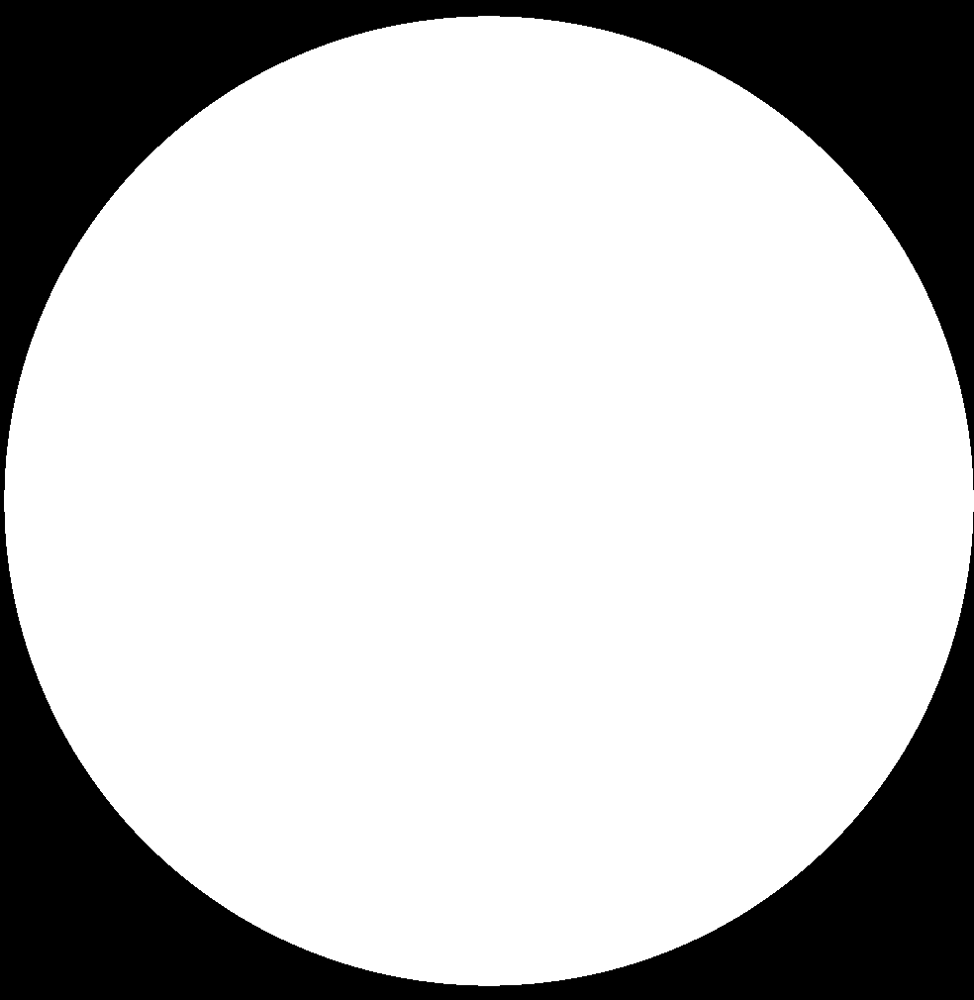
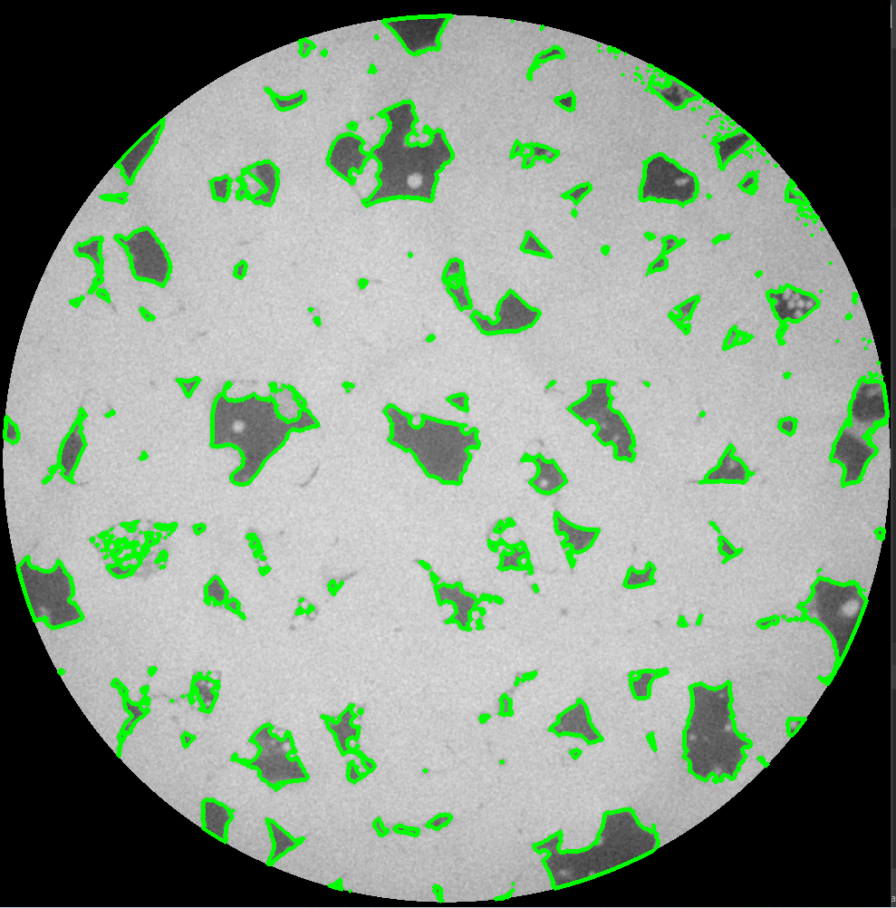
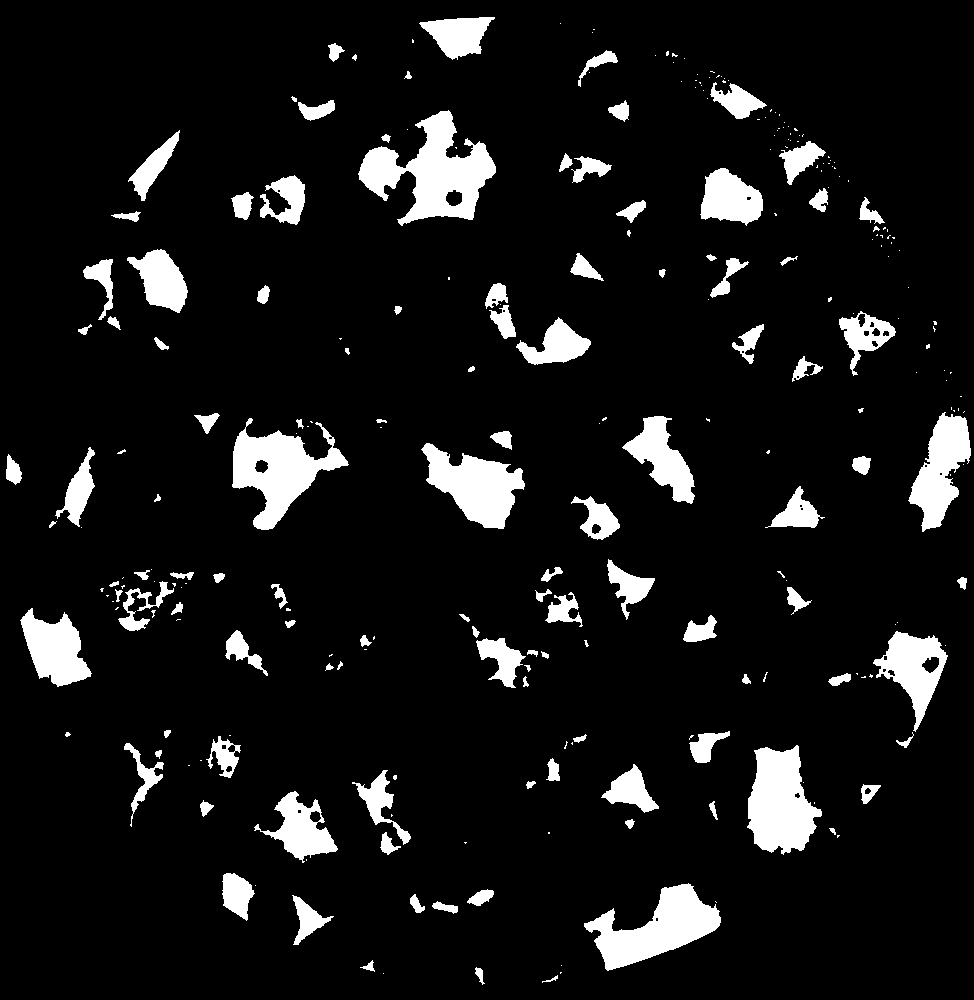

##Binarization and Removing background of image

Reference Mask to eliminate black area by drawing primary big contour

</a>

Drawing contours by generating binary image using thresholding

</a>

Binary Mask Image with no background

</a>

